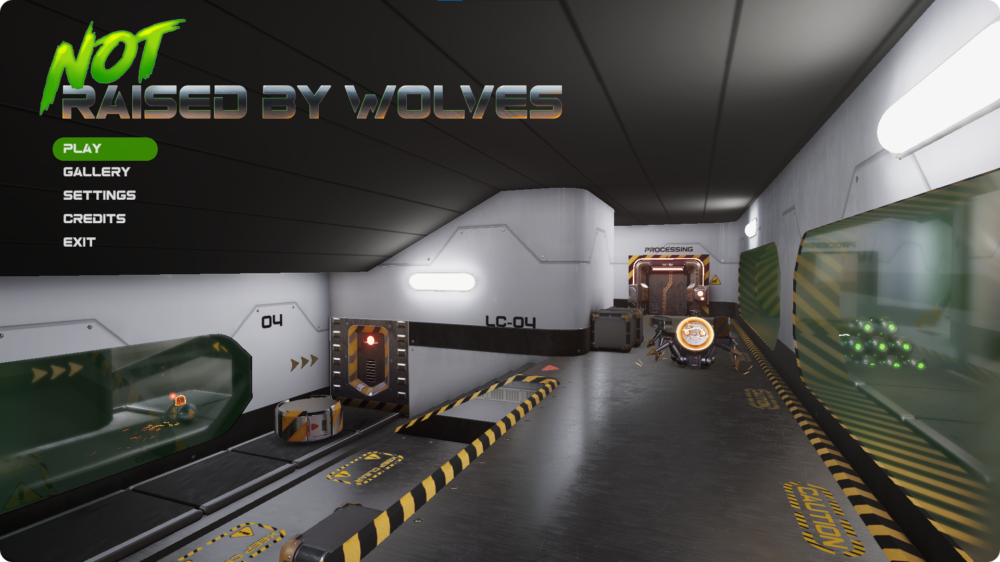
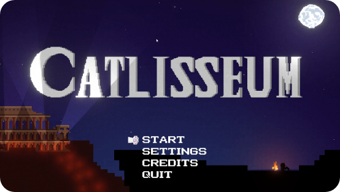
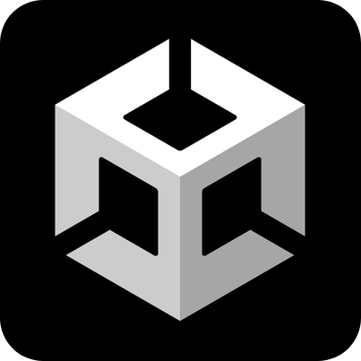
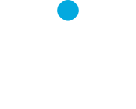

<h1 align="center">🌚 Hello, I'm Karlo 🌝</h1>

I'm a Software Engineer with Full Stack and mobile (iOS) experience.   Currently making games 👾

### 🤓 Some things about me:
---

- 🦾 Just finished working on my VFS final project (check it out below).
- 🌱 I’m currently learning more Game development and checking out new Swift features.
- 🔮 I’m looking to expand my knowledge on C++, Swift, Unreal and Unity.
- 🐶 Ask me about my doggies.
- 🐱‍👓 Reach me on my Linkedin.
- 🎹 I also make music as a hobby. That's my SoundCloud 👉 

### 🤵 My LinkedIn:
---

 

  

### 🔥 Latest projects:
---

 

  

  <table align="center" style="border:0px solid black">
    <tr>
      <td>   
        <h3 align="center"> 🐺 Not Raised By Wolves: 🐺 </h3>
        
    
        <ul>
          <li>Single player third person shooter.</li>
          <li>Made with Unity (HDRP).</li>
          <li>Made by Team Fingerguns for VFS final project.</li>
        </ul>  
      </td>
    </tr>
  </table>

<h4 align="center">Available on 👇</h3>

  

---

 

  

  <table align="center" style="border:0px solid black">
    <tr>
      <td>    
        <h3 align="center"> 🐱 Catlisseum: 🐱  </h3>
        

        <ul>
          <li>Single player 2D action platformer.</li>
          <li>Made with Unity (URP).</li>
          <li>Made by Team Revenants for VFS team project.</li>
        </ul>  
      </td>
    </tr>
  </table>

  

### 🐱‍💻 Some other (cool) projects:
---

 

  

  

  

  

### ✨ Languages:
---
 

  
  
  
  
  
  
  
  
  
  
  
  
  
    

### 💻 Technologies:
---
 

  
  
  
  
  
  
  
  
  
  
  
  
  
  
  
  
  
  
  
  
  
  
  

### 📈 Some stats:
---
 

  

  

